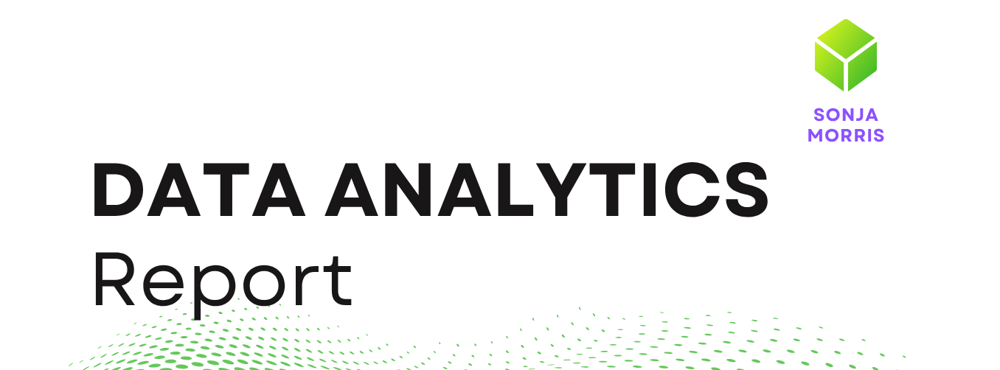

## Project Overview

This project explores how integrated data architecture and business intelligence systems can support strategic decision-making in global edTech environments.

The report was developed as a conceptual analytics framework for Horizon Learning Labs (HLL), examining how learning, HR, finance, operational, QA, and learner engagement data could be unified into a scalable analytics ecosystem.

Rather than focusing only on descriptive dashboard reporting, the framework explores how diagnostic, predictive, and eventually AI-driven analytics could support:

- learner retention
- operational scalability
- quality assurance
- coach stability
- profitability forecasting
- curriculum effectiveness
- franchise expansion
- strategic decision-making

---

## Key Concepts Explored

- Integrated Data Architecture
- Learning Analytics
- Business Intelligence
- Data Warehousing
- Predictive Analytics
- KPI Design
- Dashboard Strategy
- Cross-functional Analytics Systems
- Human-Centered Educational Data Systems

---

## Example Analytics Domains

The report explores fictional BI and analytics questions such as:

- Which hubs generate the highest long-term learner value?
- How does coach continuity influence academic growth?
- Which delivery models generate the strongest Return on Learning?
- Which hubs demonstrate scalable operational resilience?
- How can QA, HR, finance, and LMS systems be integrated into a unified analytics framework?

---

## Technical & Analytical Concepts

- Power BI dashboard architecture
- KPI and metric design
- Weighted retention indices
- Learner lifetime value modelling
- Predictive risk modelling
- Cross-functional data integration
- Centralized data warehouse concepts
- Diagnostic and prescriptive analytics

---

## Project Contents

This repository includes:

- Strategic analytics report (PDF)
- Dashboard mockups
- Conceptual BI architecture diagrams
- Fictionalized regional analytics examples
- Predictive and diagnostic analytics scenarios

---

## Author

Sonja Morris  
Education | Business Intelligence | Learning Analytics | Data Analytics
